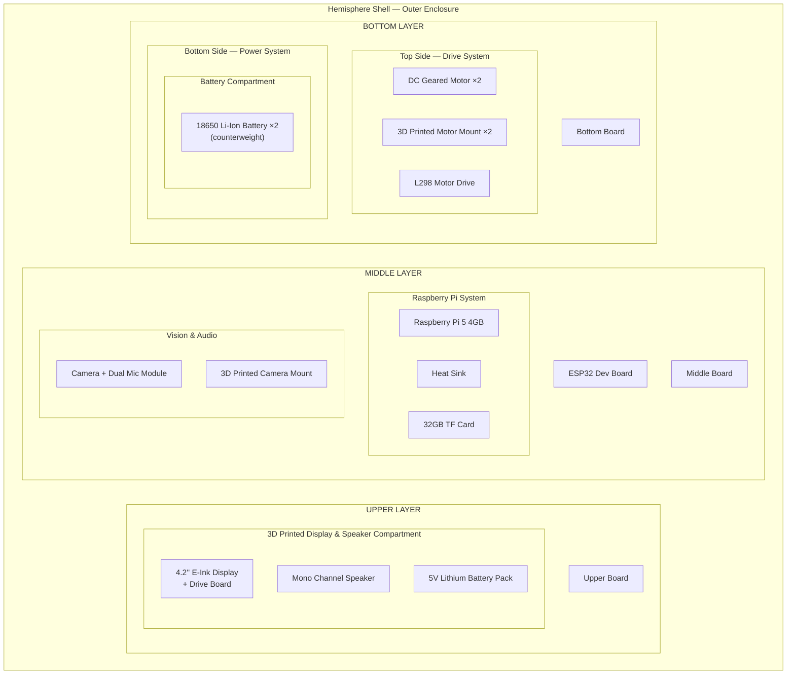

# Spherical STEM Robot — Bill of Materials

## Physical Layer Overview



---

## BOM Hierarchy Tree

```
[L0] Spherical STEM Robot
│
├── [L1] Hemisphere Shell x2
│
├── [L1] Upper Board
│   └── [L2] 3D Printed Display & Speaker Compartment
│       ├── [L3] 4.2" E-Ink Display with Drive Board
│       ├── [L3] Mono Channel Speaker
│       └── [L3] 5V Lithium Battery Pack
│
├── [L1] Middle Board
│   ├── [L2] Raspberry Pi 5 4GB
│   │   ├── [L3] Raspberry Pi 5 Heat Sink
│   │   └── [L3] 32GB TF Card
│   ├── [L2] Camera + Dual Mic Module
│   │   └── [L2] 3D Printed Camera Mount
│   └── [L2] ESP32 Dev Board
│
├── [L1] Bottom Board
│   ├── [L2] DC Geared Motor x2
│   │   └── [L2] 3D Printed Motor Mount x2
│   ├── [L2] L298 Motor Drive
│   └── [L2] Battery Compartment
│       └── [L3] 18650 Lithium Battery x2
│
└── [L3] Common Hardware & Wiring
    ├── [L3] Dupont Wire x10
    ├── [L3] USB Cable x3
    ├── [L3] m3 Screws x26
    ├── [L3] m3 Bolt x8
    ├── [L3] m3 Nut x34
    ├── [L3] m2.5 Bolt x4
    └── [L3] m2.5 Nut x4
```

---

## BOM Level Definitions

| Level | Description |
|-------|-------------|
| L0    | Complete product (Spherical STEM Robot) |
| L1    | Major structural frames and enclosures (layer boards, hemisphere shell) |
| L2    | Sub-assemblies and components mounted directly to layer boards |
| L3    | Individual components, accessories, fasteners, and wiring |

---

## Full BOM Table

| BOM Level | Material, Parts, or Components              | Qty | Location |
|-----------|---------------------------------------------|-----|----------|
| 1         | Bottom Board                                | 1   | Bottom layer — structural frame |
| 1         | Middle Board                                | 1   | Middle layer — structural frame |
| 1         | Upper Board                                 | 1   | Upper layer — structural frame |
| 1         | Hemisphere Shell                            | 2   | Outer enclosure |
| 2         | Battery Compartment                         | 1   | Bottom layer, bottom side |
| 2         | DC Geared Motor                             | 2   | Bottom layer, top side |
| 2         | 3D Printed Motor Mount                      | 2   | Bottom layer, top side |
| 2         | L298 Motor Drive                            | 1   | Bottom layer, top side |
| 2         | Raspberry Pi 5 4GB                          | 1   | Middle layer, top side |
| 2         | Camera + Dual Mic Module                    | 1   | Middle layer, top side |
| 2         | 3D Printed Camera Mount                     | 1   | Middle layer, top side |
| 2         | ESP32 Dev Board                             | 1   | Middle layer, top side |
| 2         | 3D Printed Display and Speaker Compartment  | 1   | Upper layer, top side |
| 3         | 18650 Lithium Battery                       | 2   | Inside Battery Compartment (counterweight) |
| 3         | 5V Lithium Battery Pack                     | 1   | Inside Display & Speaker Compartment |
| 3         | Raspberry Pi 5 Heat Sink                    | 1   | Mounted on Raspberry Pi 5 |
| 3         | 32GB TF Card                                | 1   | Inserted in Raspberry Pi 5 |
| 3         | 4.2" E-Ink Display with Drive Board         | 1   | Inside Display & Speaker Compartment |
| 3         | Mono Channel Speaker                        | 1   | Inside Display & Speaker Compartment |
| 3         | Dupont Wire                                 | 10  | Interconnects |
| 3         | USB Cable                                   | 3   | Power & data connections |
| 3         | m3 Screws                                   | 26  | Fasteners |
| 3         | m3 Bolt                                     | 8   | Fasteners |
| 3         | m3 Nut                                      | 34  | Fasteners |
| 3         | m2.5 Bolt                                   | 4   | Fasteners (RPi mounting) |
| 3         | m2.5 Nut                                    | 4   | Fasteners (RPi mounting) |
