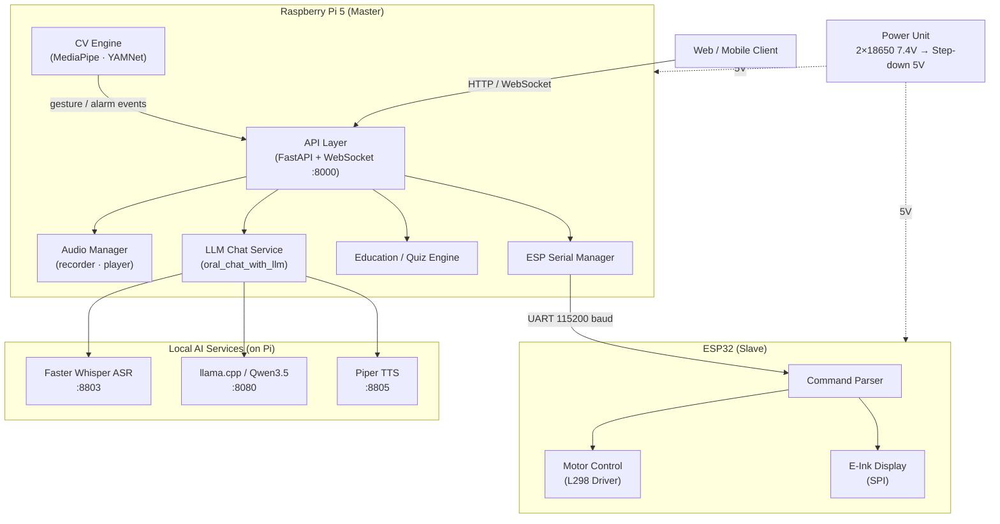
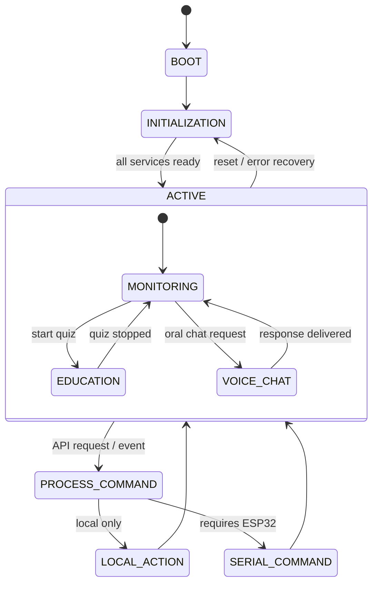
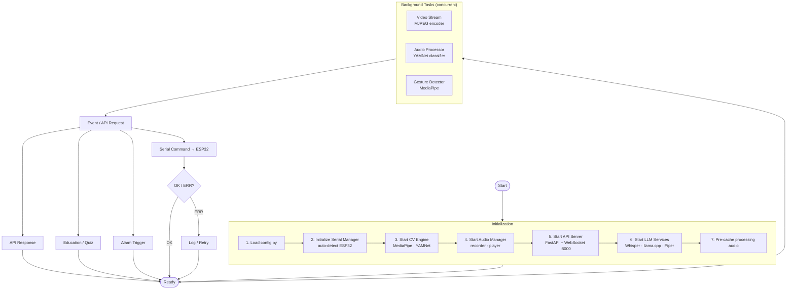
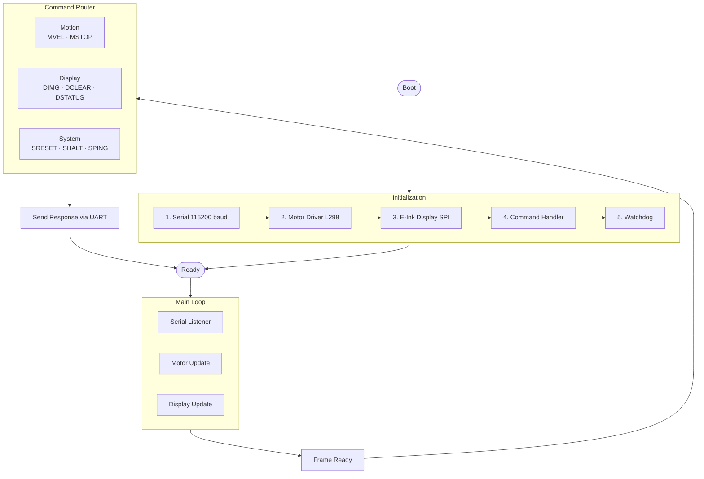
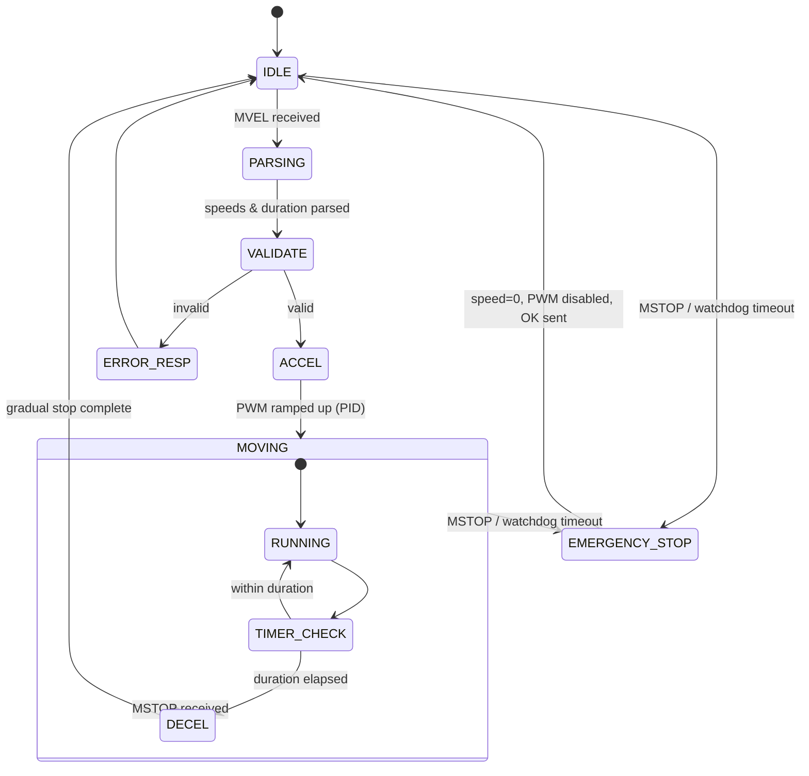
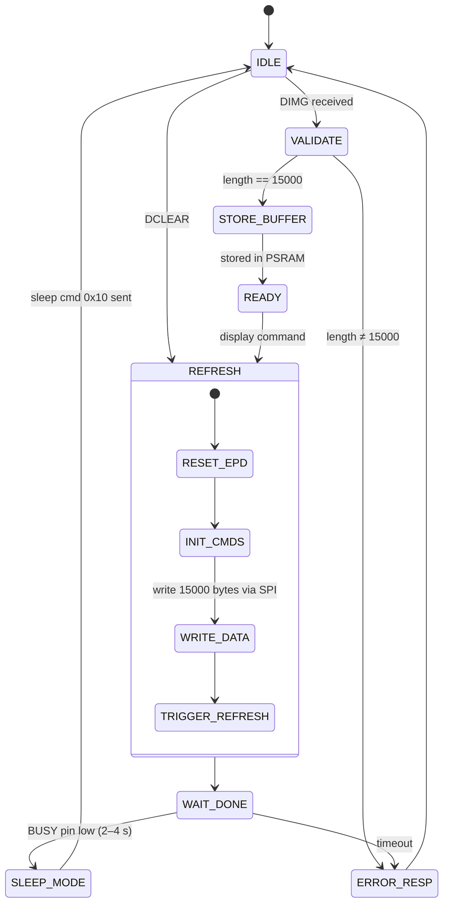
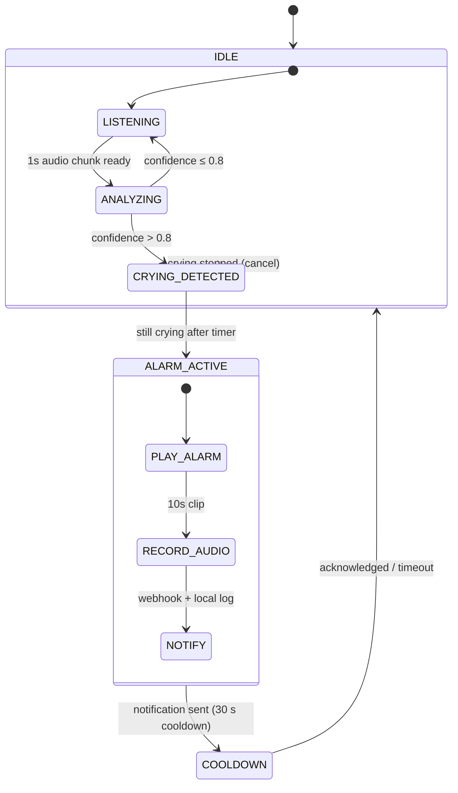
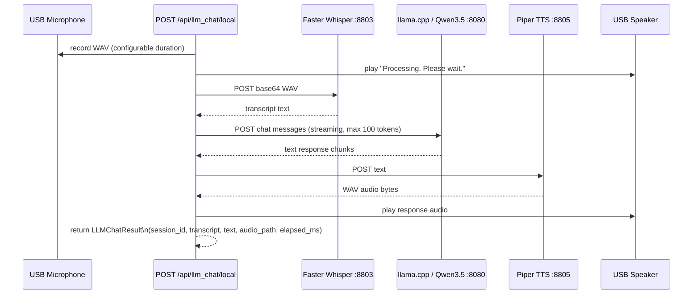

# Spherical Robot Framework Architecture

## Executive Summary

Dual-processor architecture with Raspberry Pi 5 as the primary controller and ESP32 as the motion/peripheral controller. Communication via UART serial at 115200 baud. Local AI services (Faster Whisper ASR, llama.cpp/Qwen3.5, Piper TTS) run on the Pi for spoken interaction without cloud dependency.

---

## Architecture Overview



---

## Layer 1: Communication Protocol

### Physical Layer
- **Interface:** UART (Serial)
- **Baud Rate:** 115200
- **Data Bits:** 8 / Stop Bits: 1 / Parity: None / Flow Control: None

### Protocol Framing

**Command Format (RPi5 → ESP32)**
```
<CMD><PARAM_LENGTH>\n<DATA>\n<CRC>
```
| Component | Format | Description |
|-----------|--------|-------------|
| CMD | String | Command identifier (e.g., `MVEL`, `DIMG`) |
| PARAM_LENGTH | Integer | Length of data in bytes |
| DATA | Binary | Command-specific data |
| CRC | Hex | 16-bit CRC-CCITT |
| Terminator | `\n` | Newline character |

**Response Format (ESP32 → RPi5)**
```
<STATUS><MESSAGE_LENGTH>\n<MESSAGE>\n
```
| Component | Format | Description |
|-----------|--------|-------------|
| STATUS | String | `OK`, `ERR`, or `PENDING` |
| MESSAGE_LENGTH | Integer | Length of message |
| MESSAGE | String | Response message or data |
| Terminator | `\n` | Newline character |

### Command Set

**Motion Control**

`MVEL` — Motor Velocity
```
MVEL<4>\n<left_speed><right_speed><duration_ms>\n<CRC>
```
- `left_speed`: int16 (−255 to 255), 0 = stop
- `right_speed`: int16 (−255 to 255), 0 = stop
- `duration_ms`: uint16 (0 = indefinite)

`MSTOP` — Emergency Stop
```
MSTOP<0>\n\n<CRC>
```

**Display**

`DIMG` — Display Image
```
DIMG<15000>\n<15000 bytes of image data>\n<CRC>
```
- Image data: 1-bit packed, 400×300 pixels (15 KB total)

`DCLEAR` — Clear Display | `DSTATUS` — Display Status

**System**

| Command | Description |
|---------|-------------|
| `SRESET` | Soft reset |
| `SHALT` | Enter deep sleep |
| `SPING` | Heartbeat / ping |

---

## Layer 2: Raspberry Pi 5 Framework

### Module Structure

```
spherical_bot/
├── api/
│   ├── routes.py              # FastAPI REST endpoints
│   └── websocket.py           # WebSocket event broadcasting
├── audio/
│   ├── yamnet_classifier.py   # YAMNet sound classification
│   ├── alarm_manager.py       # Crying detection & alarm state machine
│   ├── notification_manager.py# Webhook / local notification dispatch
│   ├── player.py              # Audio playback (ALSA)
│   ├── recorder.py            # Audio recording (ALSA)
│   └── cross_platform_recorder.py
├── cv_engine/
│   ├── gesture_detector.py    # MediaPipe hand tracking & finger count
│   ├── human_tracker.py       # Person detection
│   ├── image_processor.py     # E-Ink image prep (Floyd-Steinberg dither)
│   └── video_encoder.py       # MJPEG streaming
├── education/
│   ├── content_manager.py     # STEM content loading
│   ├── lesson_engine.py       # Lesson sequencing
│   └── quiz_engine.py         # Gesture-based MCQ quiz
├── LLM_Chat/
│   ├── service.py             # oral_chat_with_llm + synthesize_speech
│   ├── __init__.py
│   └── local/
│       └── fast-whisper-host.py  # Faster Whisper ASR HTTP service (:8803)
├── esp_serial/
│   ├── manager.py             # Serial connection & auto-detect
│   ├── protocol.py            # Protocol encoder / decoder
│   └── commands.py            # Command builders
├── utils/
│   ├── audio_detect.py
│   ├── esp32_port.py
│   └── serial_detect.py
├── config.py                  # All runtime configuration
└── main.py                    # Application entry point
```

### API Endpoints

| Method | Path | Description |
|--------|------|-------------|
| GET | `/health` | Health check |
| GET | `/api/status` | System status |
| POST | `/api/system/ping` | Ping ESP32 |
| POST | `/api/system/reset` | Reset ESP32 |
| POST | `/api/movement/move` | Control motors |
| POST | `/api/movement/stop` | Emergency stop |
| GET | `/api/stream/video` | MJPEG video stream |
| GET | `/api/stream/snapshot` | JPEG snapshot |
| GET | `/api/stream/audio` | WAV audio stream |
| WS | `/ws/audio` | PCM audio WebSocket |
| WS | `/ws` | Event WebSocket |
| POST | `/api/audio/upload` | Play uploaded audio file |
| POST | `/api/audio/play-base64` | Play base64 audio |
| POST | `/api/audio/tone` | Play tone |
| POST | `/api/audio/stop` | Stop playback |
| POST | `/api/tts/speak` | Edge TTS → speaker |
| POST | `/api/llm_chat/local` | Voice chat (ASR → LLM → TTS) |
| POST | `/api/display/update` | Update E-Ink display |
| POST | `/api/display/clear` | Clear E-Ink display |
| POST | `/api/quiz/start` | Start STEM gesture quiz |
| POST | `/api/quiz/stop` | Stop quiz |
| GET | `/api/quiz/status` | Quiz state |
| GET | `/api/gesture/status` | Live gesture debug |
| GET/POST | `/api/alarm/*` | Alarm control & configuration |

---

## Layer 3: ESP32 Framework

### Module Structure

```
spherical_bot_esp32/
├── config.h
├── communication/
│   ├── serial_protocol.h
│   ├── command_handler.h
│   └── response_builder.h
├── motor_control/
│   ├── l298_driver.h
│   ├── pid_controller.h
│   └── movement_logic.h
├── display/
│   ├── epd_driver.h
│   ├── image_buffer.h
│   └── display_manager.h
└── system/
    ├── watchdog.h
    └── power_management.h
```

---

## State Machine Diagrams

### System-Level State Machine



### RPi5 Startup Sequence



### ESP32 State Machine



### Motor Control State Machine



### Display Update State Machine



### Sound Detection & Alarm State Machine



### LLM Voice Chat Pipeline


